# TGO Multi-Agent Coordinator

A powerful, framework-agnostic multi-agent system that orchestrates AI agents across different frameworks with unified interfaces, memory management, and flexible workflow execution.

## 🏗️ Architecture Overview

The system is built using the **Adapter Pattern** + **Strategy Pattern** + **Factory Pattern** combination to achieve:

- **🔄 Framework Agnostic**: Support for Google ADK, LangGraph, CrewAI, and easy extension to new frameworks
- **⚡ Dynamic Switching**: Runtime framework switching with automatic fallback
- **🔀 Multiple Workflows**: Hierarchical, sequential, parallel, and custom workflow execution
- **🎯 Unified Interface**: Consistent API regardless of underlying framework
- **🧠 Memory Management**: Persistent conversation and context memory across sessions
- **🔐 Session Management**: Multi-user session handling with group chat support

## 📊 System Architecture

```mermaid
graph TB
    %% User Layer
    User[👤 User/Application] --> API[🔌 Multi-Agent API]

    %% Core Coordination Layer
    API --> Coordinator[🎯 MultiAgentCoordinator]
    Coordinator --> Registry[📋 AdapterRegistry]
    Coordinator --> WorkflowEngine[⚙️ WorkflowEngine]
    Coordinator --> SessionMgr[🔐 SessionManager]
    Coordinator --> MemoryMgr[🧠 MemoryManager]
    Coordinator --> MCPMgr[🌐 MCPToolManager]

    %% Framework Adapters Layer
    Registry --> GoogleADK[🟦 GoogleADKAdapter]
    Registry --> LangGraph[🟩 LangGraphAdapter]
    Registry --> CrewAI[🟨 CrewAIAdapter]

    %% AI Frameworks
    GoogleADK --> GoogleSDK[Google ADK Framework]
    LangGraph --> LangGraphSDK[LangGraph Framework]
    CrewAI --> CrewAISDK[CrewAI Framework]

    %% Workflow Types
    WorkflowEngine --> Single[👤 Single Agent]
    WorkflowEngine --> Hierarchical[🏢 Hierarchical]
    WorkflowEngine --> Sequential[➡️ Sequential]
    WorkflowEngine --> Parallel[⚡ Parallel]
```



## ✨ Key Features

- **🔄 Multi-Framework Support**: Seamlessly switch between Google ADK, LangGraph, CrewAI
- **🎯 Unified API**: Consistent interface regardless of underlying framework
- **🧠 Smart Memory**: Persistent conversation memory with importance scoring
- **🔐 Session Management**: Multi-user sessions with group chat support
- **⚙️ Flexible Workflows**: Single, hierarchical, sequential, and parallel execution
- **🌊 Real-time Streaming**: Live updates during task execution
- **⚡ Batch Processing**: Efficient handling of multiple tasks
- **🔧 Tool Integration**: Built-in support for external tools and APIs
- **🌐 MCP Tools**: Model Context Protocol integration for external tool access
- **📚 Knowledge Bases**: Query and integrate with knowledge repositories
- **🔍 Capability Detection**: Automatic adapter selection based on requirements
- **📊 Comprehensive Monitoring**: Detailed metrics and health monitoring
- **🛡️ Error Handling**: Robust error handling with automatic fallbacks
- **🔌 Extensible Architecture**: Easy to add new frameworks and capabilities

## 🚀 Quick Start

### Installation

```bash
# Clone the repository
git clone <repository-url>
cd tgo-agent-coordinator

# Install dependencies
poetry install

# Run the example
python example.py
```

### Basic Usage - Multi-Agent Team Collaboration

```python
import asyncio
from tgo.agents import (
    MultiAgentCoordinator, AdapterRegistry, GoogleADKAdapter,
    InMemoryMemoryManager, InMemorySessionManager
)
from tgo.agents.core.models import (
    MultiAgentConfig, AgentConfig, Task, WorkflowConfig, Session
)
from tgo.agents.core.enums import (
    AgentType, WorkflowType, ExecutionStrategy, SessionType
)

async def main():
    # 1. Initialize system components
    memory_manager = InMemoryMemoryManager()
    session_manager = InMemorySessionManager()
    registry = AdapterRegistry()
    registry.register("google-adk", GoogleADKAdapter())

    coordinator = MultiAgentCoordinator(
        registry=registry,
        memory_manager=memory_manager,
        session_manager=session_manager
    )

    # 2. Create session
    session = await session_manager.create_session(
        session_id="session_001",
        user_id="user_123",
        session_type=SessionType.SINGLE_CHAT
    )

    # 3. Configure multi-agent team (Manager + Experts)
    config = MultiAgentConfig(
        framework="google-adk",
        agents=[
            # Manager Agent - coordinates the team
            AgentConfig(
                agent_id="project_manager",
                name="Project Manager",
                agent_type=AgentType.MANAGER,
                model="gemini-2.0-flash",
                instructions="You coordinate tasks between expert agents and synthesize their results."
            ),
            # Research Expert
            AgentConfig(
                agent_id="researcher",
                name="Research Specialist",
                agent_type=AgentType.EXPERT,
                model="gemini-2.0-flash",
                instructions="You are a research expert. Provide thorough market analysis and data insights."
            ),
            # Writing Expert
            AgentConfig(
                agent_id="writer",
                name="Content Writer",
                agent_type=AgentType.EXPERT,
                model="gemini-2.0-flash",
                instructions="You are a content writer. Create clear, engaging reports from research data."
            )
        ],
        workflow=WorkflowConfig(
            workflow_type=WorkflowType.HIERARCHICAL,  # Manager coordinates experts
            execution_strategy=ExecutionStrategy.FAIL_FAST,
            manager_agent_id="project_manager",
            expert_agent_ids=["researcher", "writer"]
        )
    )

    # 4. Create task for the team
    task = Task(
        title="AI Market Analysis Report",
        description="Create a comprehensive report on current AI market trends, including key players, growth projections, and emerging technologies."
    )

    # 5. Execute multi-agent workflow
    print("🚀 Starting multi-agent collaboration...")
    result = await coordinator.execute_task(config, task, session)

    if result.is_successful():
        print("✅ Multi-agent task completed successfully!")
        print(f"📊 Final Result: {result.result}")
        print(f"👥 Agents involved: {', '.join(result.agents_used)}")
    else:
        print(f"❌ Task failed: {result.error_message}")

if __name__ == "__main__":
    asyncio.run(main())
```

**🔄 What happens in this multi-agent workflow:**
1. **Project Manager** receives the task and breaks it down into subtasks
2. **Research Specialist** analyzes market data and trends
3. **Content Writer** creates the final report structure
4. **Project Manager** synthesizes all results into a comprehensive report

This demonstrates true multi-agent collaboration where different specialists work together under coordination.

## 📁 Directory Structure

```
tgo/agents/
├── core/                          # 🏗️ Core abstractions
│   ├── interfaces.py              # Core interfaces and protocols
│   ├── models.py                  # Data models and schemas
│   ├── enums.py                   # Enumerations
│   └── exceptions.py              # Exception classes
├── registry/                      # 📋 Adapter registry
│   └── adapter_registry.py        # Framework adapter registry
├── adapters/                      # 🔌 Framework adapters
│   ├── base_adapter.py            # Base adapter implementation
│   ├── google_adk_adapter.py      # Google ADK integration
│   ├── langgraph_adapter.py       # LangGraph integration
│   └── crewai_adapter.py          # CrewAI integration
├── coordinator/                   # 🎯 Multi-agent coordination
│   ├── multi_agent_coordinator.py # Main coordinator
│   ├── workflow_engine.py         # Workflow execution engine
│   ├── task_executor.py           # Task execution logic
│   └── result_aggregator.py       # Result aggregation
├── memory/                        # 🧠 Memory management
│   ├── memory_manager.py          # Memory management implementation
│   └── session_manager.py         # Session management
├── tools/                         # 🌐 MCP tools integration
│   ├── mcp_tool_manager.py        # MCP tool manager
│   ├── mcp_connector.py           # MCP protocol connector
│   ├── mcp_tool_proxy.py          # Framework tool adapter
│   └── mcp_security_manager.py    # Security controls
├── example.py                     # 📖 Complete usage example
└── basic_session_memory_example.py # 🧠 Memory & session example
```

## 🔧 Key Components

### 1. 📋 AdapterRegistry
Centralized management of AI framework adapters with dynamic discovery:

```python
registry = AdapterRegistry()
registry.register("google-adk", GoogleADKAdapter(), is_default=True)
registry.register("langgraph", LangGraphAdapter())
registry.register("crewai", CrewAIAdapter())

# Get adapter by capability
adapter = registry.get_adapter_by_capability(FrameworkCapability.STREAMING)
```

### 2. 🎯 MultiAgentCoordinator
Orchestrates multi-agent task execution with memory and session management:

```python
# Initialize with memory and session managers in constructor
coordinator = MultiAgentCoordinator(
    registry=registry,
    memory_manager=memory_manager,
    session_manager=session_manager
)

# Execute with session context
result = await coordinator.execute_task(config, task, session)
```

### 3. 🔌 Framework Adapters
Unified interface to different AI frameworks with capability detection:

- **🟦 GoogleADKAdapter**: Google Agent Development Kit integration
- **🟩 LangGraphAdapter**: LangGraph framework integration
- **🟨 CrewAIAdapter**: CrewAI framework integration

### 4. ⚙️ Workflow Engine
Flexible execution patterns with streaming and batch support:

- **👤 Single**: Single agent execution
- **🏢 Hierarchical**: Manager-expert coordination
- **➡️ Sequential**: Pipeline-style execution
- **⚡ Parallel**: Concurrent execution
- **🎨 Custom**: User-defined workflows

### 5. 🧠 Memory & Session Management
Persistent context and conversation memory:

```python
# Store conversation memory
await memory_manager.store_memory(
    session_id="session_123",
    content="User prefers detailed explanations",
    memory_type="preference",
    session_type=SessionType.SINGLE_CHAT
)

# Retrieve relevant memories
memories = await memory_manager.retrieve_memories(
    session_id="session_123",
    limit=5,
    min_importance=0.3
)
```

### 6. 🌐 Elegant Tool Configuration
Unified tool configuration supporting both function tools and MCP tools in one array:

```python
from tgo.agents.core.models import MCPTool

# Define function tools
def calculate_metrics(revenue: float, growth_rate: float) -> dict:
    """Calculate business metrics."""
    return {
        "projected_revenue": revenue * (1 + growth_rate),
        "growth_percentage": growth_rate * 100
    }

async def fetch_data(source: str) -> str:
    """Async function tool for data fetching."""
    # Simulate async data fetching
    await asyncio.sleep(0.1)
    return f"Data from {source}"

# Define MCP tools
web_search_tool = MCPTool(
    name="web_search",
    description="Search the web for information",
    input_schema={
        "type": "object",
        "properties": {
            "query": {"type": "string"},
            "max_results": {"type": "integer", "default": 5}
        },
        "required": ["query"]
    },
    server_id="web_api"
)

file_reader_tool = MCPTool(
    name="read_file",
    description="Read content from a file",
    input_schema={
        "type": "object",
        "properties": {
            "file_path": {"type": "string"}
        },
        "required": ["file_path"]
    },
    server_id="filesystem"
)

# Configure agent with elegant mixed tools
agent_config = AgentConfig(
    agent_id="research_agent",
    name="Research Agent",
    agent_type=AgentType.EXPERT,
    model="gemini-2.0-flash",
    instructions="You have access to calculation functions, data fetching, web search, and file operations.",
    tools=[
        calculate_metrics,    # Function tool
        fetch_data,          # Async function tool
        web_search_tool,     # MCP tool
        file_reader_tool     # MCP tool
    ]  # Elegant: All tools in one array!
)

# Tool type detection
print(f"Function tools: {len(agent_config.get_function_tools())}")  # 2
print(f"MCP tools: {len(agent_config.get_mcp_tools())}")           # 2
print(f"Has MCP tools: {agent_config.has_mcp_tools()}")           # True
```

## 💡 Usage Examples

### Example 1: Single Agent Execution

```python
import asyncio
from tgo.agents import MultiAgentCoordinator, AdapterRegistry, GoogleADKAdapter
from tgo.agents.core.models import MultiAgentConfig, AgentConfig, Task, WorkflowConfig
from tgo.agents.core.enums import AgentType, WorkflowType, ExecutionStrategy

async def single_agent_example():
    # Setup with memory and session management
    memory_manager = InMemoryMemoryManager()
    session_manager = InMemorySessionManager()
    registry = AdapterRegistry()
    registry.register("google-adk", GoogleADKAdapter())

    coordinator = MultiAgentCoordinator(
        registry=registry,
        memory_manager=memory_manager,
        session_manager=session_manager
    )

    # Create session
    session = await session_manager.create_session(
        session_id="session_001",
        user_id="user_123",
        session_type=SessionType.SINGLE_CHAT
    )

    # Configure single agent
    config = MultiAgentConfig(
        framework="google-adk",
        agents=[
            AgentConfig(
                agent_id="analyst_001",
                name="Market Analyst",
                agent_type=AgentType.EXPERT,
                model="gemini-2.0-flash",
                instructions="You are a market analyst. Provide detailed insights."
            )
        ],
        workflow=WorkflowConfig(
            workflow_type=WorkflowType.SINGLE,
            execution_strategy=ExecutionStrategy.FAIL_FAST
        )
    )

    # Execute task with session
    task = Task(
        title="Analyze AI Market Trends",
        description="Provide comprehensive analysis of AI market trends"
    )

    result = await coordinator.execute_task(config, task, session)
    print(f"Result: {result.result}")

asyncio.run(single_agent_example())
```

### Example 2: Hierarchical Multi-Agent Workflow

```python
async def hierarchical_example():
    # Configure hierarchical system with manager and experts
    config = MultiAgentConfig(
        framework="google-adk",
        agents=[
            AgentConfig(
                agent_id="manager_001",
                name="Project Manager",
                agent_type=AgentType.MANAGER,
                instructions="Coordinate tasks between expert agents"
            ),
            AgentConfig(
                agent_id="researcher_001",
                name="Research Expert",
                agent_type=AgentType.EXPERT,
                instructions="Provide thorough research and analysis"
            ),
            AgentConfig(
                agent_id="writer_001",
                name="Technical Writer",
                agent_type=AgentType.EXPERT,
                instructions="Create clear technical documentation"
            )
        ],
        workflow=WorkflowConfig(
            workflow_type=WorkflowType.HIERARCHICAL,
            manager_agent_id="manager_001",
            expert_agent_ids=["researcher_001", "writer_001"]
        )
    )

    # Complex task requiring coordination
    task = Task(
        title="Create AI Implementation Guide",
        description="Research and create comprehensive AI implementation guide"
    )

    # Execute with streaming updates
    async for update in coordinator.execute_task_stream(config, task):
        print(f"Update: {update}")

asyncio.run(hierarchical_example())
```

### Example 3: Memory and Session Management

```python
from tgo.agents import (
    MultiAgentCoordinator, AdapterRegistry, GoogleADKAdapter,
    InMemoryMemoryManager, InMemorySessionManager
)
from tgo.agents.core.models import Session
from tgo.agents.core.enums import SessionType

async def memory_example():
    # Setup with memory and session management
    memory_manager = InMemoryMemoryManager()
    session_manager = InMemorySessionManager()
    registry = AdapterRegistry()
    registry.register("google-adk", GoogleADKAdapter())

    coordinator = MultiAgentCoordinator(
        registry=registry,
        memory_manager=memory_manager,
        session_manager=session_manager
    )

    # Create session
    session = await session_manager.create_session(
        session_id="session_123",
        user_id="user_456",
        session_type=SessionType.SINGLE_CHAT
    )

    # Store context memory
    await memory_manager.store_memory(
        session_id="session_123",
        content="User prefers detailed technical explanations",
        memory_type="preference",
        session_type=SessionType.SINGLE_CHAT
    )

    # Execute task with memory context
    result = await coordinator.execute_task(config, task, session)

asyncio.run(memory_example())
```

### Example 4: MCP Tools Integration

```python
from tgo.agents import (
    MultiAgentCoordinator, AdapterRegistry, GoogleADKAdapter,
    MCPToolManager, MCPServerConfig, InMemoryMemoryManager, InMemorySessionManager
)
from tgo.agents.core.models import MultiAgentConfig, AgentConfig, Task, WorkflowConfig
from tgo.agents.core.enums import AgentType, WorkflowType

async def mcp_tools_example():
    # Configure MCP servers
    config = {
        "mcpServers": {
            # A remote HTTP server
            "weather": {
                "url": "https://weather-api.example.com/mcp",
                "transport": "streamable-http"
            },
            # A local server running via stdio
            "math_server": {
                "command": "python",
                "args": ["./fastmcp_simple_server.py"],
                "env": {"DEBUG": "true"}
            }
        }
    }
    # Setup MCP tool manager
    mcp_manager = MCPToolManager(config)

    # Setup coordinator with MCP support
    registry = AdapterRegistry()
    registry.register("google-adk", GoogleADKAdapter())

    coordinator = MultiAgentCoordinator(
        registry=registry,
        memory_manager=InMemoryMemoryManager(),
        session_manager=InMemorySessionManager(),
        mcp_tool_manager=mcp_manager
    )

    # Configure agents with MCP tool access
    calculator_tool = MCPTool(
        name="calculate",
        description="Real MCP calculator via Stdio Transport",
        input_schema={
            "type": "object",
            "properties": {
                "expression": {"type": "string", "description": "Mathematical expression to evaluate"}
            },
            "required": ["expression"]
        },
        server_id="math_server",  # Must match MCPServerConfig server_id
        requires_confirmation=False
    )
    config = MultiAgentConfig(
        framework="google-adk",
        agents=[
            AgentConfig(
                agent_id="data_processor",
                name="Data Processing Agent",
                agent_type=AgentType.EXPERT,
                model="gemini-2.0-flash",
                instructions="You can read files and query databases using MCP tools.",
                tools=[calculator_tool]
            )
        ],
        workflow=WorkflowConfig(
            workflow_type=WorkflowType.SINGLE
        )
    )

    # Create task that requires MCP tools
    task = Task(
        title="Data Analysis Report",
        description="Read data files and query database to create analysis report",
        input_data={
            "data_file": "/workspace/sales_data.csv",
            "query": "SELECT * FROM customers WHERE region = 'North'"
        }
    )

    # Execute task with MCP tools
    result = await coordinator.execute_task(config, task)

    if result.is_successful():
        print("✅ MCP-enabled task completed!")
        print(f"📊 Result: {result.result}")
    else:
        print(f"❌ Task failed: {result.error_message}")

    # Cleanup
    await mcp_manager.shutdown()

asyncio.run(mcp_tools_example())
```

## 🚀 Advanced Features

### Framework Switching with Fallback
Automatic fallback to alternative frameworks when primary framework fails:

```python
config = MultiAgentConfig(
    framework="google-adk",
    fallback_frameworks=["langgraph", "crewai"],
    agents=[...],
    workflow=WorkflowConfig(...)
)

# System automatically tries fallback frameworks if primary fails
result = await coordinator.execute_task(config, task)
```

### Streaming Execution
Real-time updates during task execution:

```python
async for update in coordinator.execute_task_stream(config, task):
    if update.get("type") == "agent_started":
        print(f"Agent {update.get('agent_id')} started")
    elif update.get("type") == "agent_completed":
        print(f"Agent {update.get('agent_id')} completed")
    elif update.get("type") == "workflow_completed":
        print("Workflow completed successfully")
```

### Batch Processing
Execute multiple tasks efficiently:

```python
tasks = [
    Task(title="Task 1", description="First task"),
    Task(title="Task 2", description="Second task"),
    Task(title="Task 3", description="Third task")
]

results = await coordinator.execute_batch_tasks(config, tasks)
for i, result in enumerate(results):
    print(f"Task {i+1}: {'Success' if result.is_successful() else 'Failed'}")
```

### Capability-Based Adapter Selection
Automatically select adapters based on required capabilities:

```python
# Get adapter that supports streaming
streaming_adapter = registry.get_adapter_by_capability(
    FrameworkCapability.STREAMING
)

# Get adapters supporting multiple capabilities
multi_capable_adapters = registry.get_adapters_by_capabilities([
    FrameworkCapability.TOOL_CALLING,
    FrameworkCapability.KNOWLEDGE_BASE
])
```

### MCP Tools Security and Management
Advanced security controls and management for MCP tools:

```python
from tgo.agents.tools.mcp_security_manager import MCPSecurityManager, SecurityPolicy, SecurityLevel

# Configure security policies
security_manager = MCPSecurityManager()

# Restrictive policy for sensitive agents
restrictive_policy = SecurityPolicy(
    allowed_tools={"read_file", "safe_query"},
    denied_tools={"delete_file", "system_command"},
    max_calls_per_minute=10,
    security_level=SecurityLevel.HIGH,
    require_approval_for_untrusted=True
)

# Set policy for specific agent
security_manager.set_policy("sensitive_agent", restrictive_policy)

# Create MCP manager with security
mcp_manager = MCPToolManager(security_manager=security_manager)

# Check tool permissions
permission = await mcp_manager.check_tool_permission(
    agent_id="sensitive_agent",
    tool_name="read_file",
    context=execution_context
)
print(f"Permission: {permission}")  # "allow", "deny", or "require_approval"

# Get security audit log
audit_log = mcp_manager.get_security_audit_log(limit=50)
for entry in audit_log:
    print(f"{entry['timestamp']}: {entry['event_type']} - {entry['message']}")
```

### Tool Integration and Knowledge Base Queries
Agents can call tools and query knowledge bases:

```python
# Tool calling through agents
tool_result = await adapter.call_tool(
    agent_id="expert_001",
    tool_id="search_tool",
    tool_name="web_search",
    parameters={"query": "latest AI trends"},
    context=execution_context
)

# MCP tool calling with security
mcp_result = await adapter.call_mcp_tool(
    agent_id="expert_001",
    tool_name="filesystem_read",
    arguments={"path": "/data/report.txt"},
    context=execution_context,
    user_approved=True
)

# Knowledge base queries
kb_result = await adapter.query_knowledge_base(
    agent_id="expert_001",
    kb_id="company_kb",
    kb_name="Company Knowledge Base",
    query="AI implementation best practices",
    context=execution_context
)
```

## Key Design Decisions

### 1. Adapter Pattern
- **Why**: Provides unified interface across different AI frameworks
- **Benefit**: Easy to add new frameworks without changing existing code

### 2. Registry Pattern  
- **Why**: Centralized management of framework adapters
- **Benefit**: Dynamic discovery and switching of frameworks

### 3. Strategy Pattern for Workflows
- **Why**: Different execution strategies for different use cases
- **Benefit**: Flexible workflow execution without tight coupling

### 4. Pydantic Models
- **Why**: Type safety and validation
- **Benefit**: Catch errors early and provide clear interfaces

### 5. Async/Await Throughout
- **Why**: Non-blocking execution for better performance
- **Benefit**: Handle multiple agents and tasks concurrently

## Extension Points

### Adding New Frameworks
1. Create new adapter inheriting from `BaseFrameworkAdapter`
2. Implement required abstract methods
3. Register with the registry

### Adding New Workflow Types
1. Add new workflow type to `WorkflowType` enum
2. Implement handler in `WorkflowEngine`
3. Update coordinator to support new type

### Adding New Capabilities
1. Add capability to `FrameworkCapability` enum
2. Update adapters to declare support
3. Use capability checks in coordination logic

## Migration from Old Architecture

The old architecture used a single `GoogleADKAdapter` with tight coupling. The new architecture:

1. **Abstracts frameworks** behind unified interfaces
2. **Separates concerns** with dedicated components
3. **Enables extensibility** through adapter pattern
4. **Provides type safety** with Pydantic models
5. **Supports multiple workflows** beyond single-agent execution


## 📈 Performance and Monitoring

The architecture provides comprehensive monitoring and performance features:

### Execution Metrics
- **Timing**: Detailed execution time tracking
- **Resource Usage**: Memory and CPU monitoring
- **Token Counting**: LLM token usage tracking
- **Success Rates**: Task and agent success metrics

### Health Monitoring
```python
# Check adapter health
health_status = await registry.get_health_status()
for adapter_name, status in health_status.items():
    print(f"{adapter_name}: {status}")

# Monitor execution metrics
metrics = result.get_execution_metrics()
print(f"Execution time: {metrics.total_duration_ms}ms")
print(f"Token usage: {metrics.total_tokens}")
```

### Concurrent Execution
- Parallel task processing across multiple agents
- Asynchronous execution with proper resource management
- Configurable concurrency limits

## 🔍 Troubleshooting

### Common Issues

1. **Framework Not Available**
   ```python
   # Check if adapter is registered
   if not registry.is_registered("google-adk"):
       registry.register("google-adk", GoogleADKAdapter())
   ```

2. **Configuration Errors**
   ```python
   # Validate configuration before execution
   try:
       config.model_validate(config_dict)
   except ValidationError as e:
       print(f"Configuration error: {e}")
   ```

3. **Memory Issues**
   ```python
   # Check memory manager status
   if not coordinator._memory_manager:
       await coordinator.set_memory_manager(InMemoryMemoryManager())
   ```

### Debug Mode

Enable comprehensive debugging:
```python
import logging
logging.basicConfig(
    level=logging.DEBUG,
    format='%(asctime)s - %(name)s - %(levelname)s - %(message)s'
)

# Enable specific logger
logger = logging.getLogger('src.coordinator')
logger.setLevel(logging.DEBUG)
```

## 🚀 Future Enhancements

### Completed ✅
1. **Multi-Framework Support**: Google ADK, LangGraph, CrewAI adapters
2. **Memory Management**: Persistent conversation and context memory
3. **Session Management**: Multi-user session handling
4. **Workflow Engine**: Multiple execution patterns
5. **Streaming Support**: Real-time execution updates

### Planned 🔄
1. **Caching Layer**: Result caching for improved performance
2. **Security Layer**: Authentication and authorization
3. **Configuration Management**: Environment-based configuration
4. **Distributed Execution**: Multi-node agent coordination
5. **Advanced Monitoring**: Grafana/Prometheus integration
6. **Plugin System**: Dynamic capability extension

## 📄 License

[Add license information here]

## 🤝 Contributing

We welcome contributions! Please see our contributing guidelines for details.

### Development Setup

```bash
# Clone and setup development environment
git clone <repository-url>
cd tgo-agent-coordinator
pip install -r requirements-dev.txt

# Run tests
python -m pytest tests/

# Run linting
python -m flake8 src/
python -m mypy src/
```

## 📞 Support

For questions or support:
- Create an issue on GitHub
- Check the documentation
- Contact the maintainer team

## 🙏 Acknowledgments

Special thanks to:
- Google ADK team for the excellent framework
- LangGraph and CrewAI communities
- Contributors and early adopters
