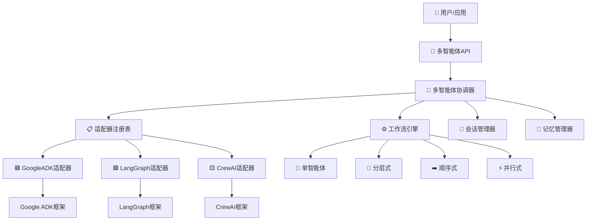

# TGO 多智能体协调器

一个强大的、框架无关的多智能体系统，通过统一接口、内存管理和灵活的工作流执行来协调不同框架的AI智能体。

## 🏗️ 架构概览

系统采用 **适配器模式** + **策略模式** + **工厂模式** 的组合来实现：

- **🔄 框架无关**: 支持 Google ADK、LangGraph、CrewAI，并可轻松扩展到新框架
- **⚡ 动态切换**: 运行时框架切换，支持自动回退
- **🔀 多种工作流**: 分层、顺序、并行和自定义工作流执行
- **🎯 统一接口**: 无论底层框架如何，都提供一致的API
- **🧠 记忆管理**: 跨会话的持久对话和上下文记忆
- **🔐 会话管理**: 多用户会话处理，支持群聊

## 📊 系统架构图



## 🚀 快速开始

### 安装

```bash
# 克隆仓库
git clone <repository-url>
cd tgo-agent-coordinator

# 安装依赖
pip install -r requirements.txt

# 运行示例
python example.py
```

### 基础用法 - 多智能体团队协作

```python
import asyncio
from tgo.agents import (
    MultiAgentCoordinator, AdapterRegistry, GoogleADKAdapter,
    InMemoryMemoryManager, InMemorySessionManager
)
from tgo.agents.core.models import (
    MultiAgentConfig, AgentConfig, Task, WorkflowConfig, Session
)
from tgo.agents.core.enums import (
    AgentType, WorkflowType, ExecutionStrategy, SessionType
)

async def main():
    # 1. 初始化系统组件
    memory_manager = InMemoryMemoryManager()
    session_manager = InMemorySessionManager()
    registry = AdapterRegistry()
    registry.register("google-adk", GoogleADKAdapter())

    coordinator = MultiAgentCoordinator(
        registry=registry,
        memory_manager=memory_manager,
        session_manager=session_manager
    )

    # 2. 创建会话
    await session_manager.create_session("session_001", "user_123", SessionType.SINGLE_CHAT)
    session = Session(session_id="session_001", user_id="user_123", session_type=SessionType.SINGLE_CHAT)

    # 3. 配置多智能体团队（管理者 + 专家）
    config = MultiAgentConfig(
        framework="google-adk",
        agents=[
            # 管理者智能体 - 协调团队
            AgentConfig(
                agent_id="project_manager",
                name="项目经理",
                agent_type=AgentType.MANAGER,
                model="gemini-2.0-flash",
                instructions="你负责协调专家智能体之间的任务并综合他们的结果。"
            ),
            # 研究专家
            AgentConfig(
                agent_id="researcher",
                name="研究专家",
                agent_type=AgentType.EXPERT,
                model="gemini-2.0-flash",
                instructions="你是研究专家。提供全面的市场分析和数据洞察。"
            ),
            # 写作专家
            AgentConfig(
                agent_id="writer",
                name="内容撰写专家",
                agent_type=AgentType.EXPERT,
                model="gemini-2.0-flash",
                instructions="你是内容撰写专家。根据研究数据创建清晰、引人入胜的报告。"
            )
        ],
        workflow=WorkflowConfig(
            workflow_type=WorkflowType.HIERARCHICAL,  # 管理者协调专家
            execution_strategy=ExecutionStrategy.FAIL_FAST,
            manager_agent_id="project_manager",
            expert_agent_ids=["researcher", "writer"]
        )
    )

    # 4. 为团队创建任务
    task = Task(
        title="AI市场分析报告",
        description="创建一份关于当前AI市场趋势的综合报告，包括主要参与者、增长预测和新兴技术。"
    )

    # 5. 执行多智能体工作流
    print("🚀 开始多智能体协作...")
    result = await coordinator.execute_task(config, task, session)

    if result.is_successful():
        print("✅ 多智能体任务成功完成！")
        print(f"📊 最终结果: {result.result}")
        print(f"👥 参与的智能体: {', '.join(result.agents_used)}")
    else:
        print(f"❌ 任务失败: {result.error_message}")

if __name__ == "__main__":
    asyncio.run(main())
```

**🔄 此多智能体工作流中发生的事情：**
1. **项目经理** 接收任务并将其分解为子任务
2. **研究专家** 分析市场数据和趋势
3. **内容撰写专家** 创建最终报告结构
4. **项目经理** 将所有结果综合成一份综合报告

这展示了真正的多智能体协作，不同的专家在协调下共同工作。

## 📁 目录结构

```
tgo/agents/
├── core/                          # 🏗️ 核心抽象
│   ├── interfaces.py              # 核心接口和协议
│   ├── models.py                  # 数据模型和模式
│   ├── enums.py                   # 枚举类型
│   └── exceptions.py              # 异常类
├── registry/                      # 📋 适配器注册表
│   └── adapter_registry.py        # 框架适配器注册表
├── adapters/                      # 🔌 框架适配器
│   ├── base_adapter.py            # 基础适配器实现
│   ├── google_adk_adapter.py      # Google ADK集成
│   ├── langgraph_adapter.py       # LangGraph集成
│   └── crewai_adapter.py          # CrewAI集成
├── coordinator/                   # 🎯 多智能体协调
│   ├── multi_agent_coordinator.py # 主协调器
│   ├── workflow_engine.py         # 工作流执行引擎
│   ├── task_executor.py           # 任务执行逻辑
│   └── result_aggregator.py       # 结果聚合
├── memory/                        # 🧠 记忆管理
│   ├── memory_manager.py          # 记忆管理实现
│   └── session_manager.py         # 会话管理
├── example.py                     # 📖 完整使用示例
└── debug_example.py               # 🔧 调试示例
```

## 🔧 核心组件

### 1. 📋 适配器注册表 (AdapterRegistry)
集中管理AI框架适配器，支持动态发现：

```python
registry = AdapterRegistry()
registry.register("google-adk", GoogleADKAdapter(), is_default=True)
registry.register("langgraph", LangGraphAdapter())
registry.register("crewai", CrewAIAdapter())

# 根据能力获取适配器
adapter = registry.get_adapter_by_capability(FrameworkCapability.STREAMING)
```

### 2. 🎯 多智能体协调器 (MultiAgentCoordinator)
协调多智能体任务执行，支持记忆和会话管理：

```python
# 在构造函数中传入记忆和会话管理器
coordinator = MultiAgentCoordinator(
    registry=registry,
    memory_manager=memory_manager,
    session_manager=session_manager
)

# 执行任务（带会话上下文）
result = await coordinator.execute_task(config, task, session)
```

### 3. 🔌 框架适配器
为不同AI框架提供统一接口，支持能力检测：

- **🟦 GoogleADKAdapter**: Google Agent Development Kit集成
- **🟩 LangGraphAdapter**: LangGraph框架集成  
- **🟨 CrewAIAdapter**: CrewAI框架集成

### 4. ⚙️ 工作流引擎
灵活的执行模式，支持流式和批处理：

- **👤 单智能体**: 单个智能体执行
- **🏢 分层式**: 管理者-专家协调
- **➡️ 顺序式**: 管道式执行
- **⚡ 并行式**: 并发执行
- **🎨 自定义**: 用户定义的工作流

### 5. 🧠 记忆和会话管理
持久化上下文和对话记忆：

```python
# 存储对话记忆
await memory_manager.store_memory(
    session_id="session_123",
    content="用户偏好详细解释",
    memory_type="preference",
    session_type=SessionType.SINGLE_CHAT
)

# 检索相关记忆
memories = await memory_manager.retrieve_memories(
    session_id="session_123",
    limit=5,
    min_importance=0.3
)
```

## 💡 使用示例

### 高级功能

#### 框架切换与回退
```python
config = MultiAgentConfig(
    framework="google-adk",
    fallback_frameworks=["langgraph", "crewai"],
    # ... 其他配置
)
```

#### 流式执行
```python
async for update in coordinator.execute_task_stream(config, task):
    print(f"更新: {update}")
```

#### 批处理
```python
results = await coordinator.execute_batch_tasks(config, [task1, task2, task3])
```

## 🎯 核心设计决策

### 1. 适配器模式
- **原因**: 为不同AI框架提供统一接口
- **优势**: 易于添加新框架而不改变现有代码

### 2. 注册表模式  
- **原因**: 集中管理框架适配器
- **优势**: 动态发现和切换框架

### 3. 工作流策略模式
- **原因**: 不同用例需要不同的执行策略
- **优势**: 灵活的工作流执行，无紧耦合

### 4. Pydantic模型
- **原因**: 类型安全和验证
- **优势**: 早期发现错误，提供清晰接口

### 5. 全异步设计
- **原因**: 非阻塞执行，提高性能
- **优势**: 并发处理多个智能体和任务

## 🔧 扩展点

### 添加新框架
1. 创建继承自 `BaseFrameworkAdapter` 的新适配器
2. 实现必需的抽象方法
3. 在注册表中注册

### 添加新工作流类型
1. 在 `WorkflowType` 枚举中添加新工作流类型
2. 在 `WorkflowEngine` 中实现处理器
3. 更新协调器以支持新类型

### 添加新能力
1. 在 `FrameworkCapability` 枚举中添加能力
2. 更新适配器以声明支持
3. 在协调逻辑中使用能力检查

## 🧪 测试

运行测试套件验证功能：

```bash
# 运行基础测试
python src/tests/test_multi_agent_system.py

# 运行完整示例
python example.py

# 运行记忆和会话示例
python basic_session_memory_example.py
```

## 📈 性能和监控

新架构提供：

- **执行指标**: 详细的时间和资源使用情况
- **健康监控**: 适配器和系统健康状态
- **并发执行**: 并行任务处理
- **资源管理**: 自动清理和生命周期管理

## 🔍 故障排除

### 常见问题

1. **框架不可用**: 确保适配器已注册并初始化
2. **配置错误**: 使用 `ConfigValidator` 检查配置
3. **执行失败**: 检查日志和适配器状态

### 调试模式

启用调试日志：
```python
import logging
logging.basicConfig(level=logging.DEBUG)
```

## 🚀 未来增强

1. **工作流定义**: YAML/JSON工作流定义 ✅
2. **智能体工厂**: 基于需求的动态智能体创建 ✅
3. **监控集成**: 详细指标和可观测性 ✅
4. **缓存层**: 结果缓存以提高性能
5. **安全层**: 身份验证和授权
6. **配置管理**: 基于环境的配置

## 📄 许可证

[在此添加许可证信息]

## 🤝 贡献

欢迎贡献！请查看贡献指南了解详情。

## 📞 支持

如有问题或需要支持，请：
- 创建 Issue
- 查看文档
- 联系维护团队
